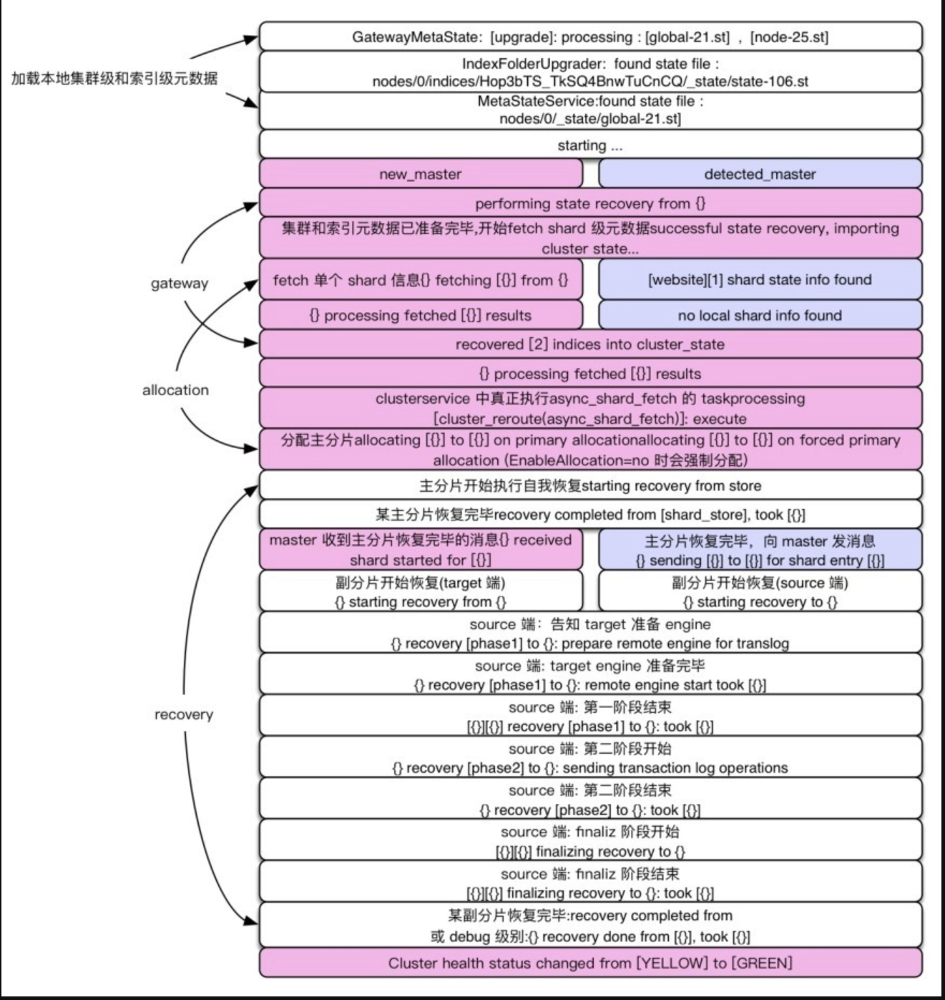

# Elasticsearch

## 基本概念原理

Elasticsearch是实时的分布式搜索分析引擎，内部使用Lucene做索引与搜索。

分布式意味着可以动态调整集群规模，弹性扩容，而这一切操作起来都非常简便，用户甚至不必了解集群原理就可以实现。

数据分片以提高水平扩展能力，分布式存储中还会把数据复制成多个副本，放置到不同的机器中，这样一来可以增加系统可用性，同时数据副本还可以使读操作并发执行，分担集群压力。但是多数据副本也带来了一致性的问题：部分副本写成功，部分副本写失败。

ES将数据副本分为主从两部分，即主分片（primaryshard）和副分片（replica shard）。主数据作为权威数据，写过程中先写主分片，成功后再写副分片，恢复阶段以主分片为准。

分片（shard）是底层的基本读写单元，分片的目的是分割巨大索引，让读写可以并行操作，由多台机器共同完成。读写请求最终落到某个分片上，分片可以独立执行读写工作。ES利用分片将数据分发到集群内各处。分片是数据的容器，文档保存在分片内，不会跨分片存储。分片又被分配到集群内的各个节点里。当集群规模扩大或缩小时，ES 会自动在各节点中迁移分片，使数据仍然均匀分布在集群里。

一个ES索引包含很多分片，一个分片是一个Lucene的索引，它本身就是一个完整的搜索引擎，可以独立执行建立索引和搜索任务。Lucene索引又由很多分段组成，每个分段都是一个倒排索引。ES每次“refresh”都会生成一个新的分段，其中包含若干文档的数据。在每个分段内部，文档的不同字段被单独建立索引。

索引建立的时候就需要确定好主分片数 副分片数可以随时修改

搜索1个有着50个分片的索引与搜索50个每个都有1个分片的索引完全等价

以_id 为单位删除文档不会立刻释放空间，删除的 doc 只在 Lucene分段合并时才会真正从磁盘中删除。即使手工触发分段合并，仍然会引起较高的 I/O 压力，并且可能因为分段巨大导致在合并过程中磁盘空间不足（分段大小大于磁盘可用空间的一半）。因此，我们建议周期性地创建新索引。

集群整体分片数量较多，集群管理的总分片数越多压力就越大。可以使用_shrink API来缩减主分片数量，降低集群负载。

倒排索引一旦被写入文件后就具有不变性，不变性具有许多好处：对文件的访问不需要加锁，读取索引时可以被文件系统缓存等。

新增内容并写到一个新的倒排索引中，查询时，每个倒排索引都被轮流查询，查询完再对结果进行合并。每次内存缓冲的数据被写入文件时，会产生一个新的Lucene段，每个段都是一个倒排索引。在一个记录元信息的文件中描述了当前Lucene索引都含有哪些分段。由于分段的不变性，更新、删除等操作实际上是将数据标记为删除，记录到单独的位置，这种方式称为标记删除。因此删除部分数据不会释放磁盘空间。

近实时搜索

一般情况下（direct方式除外），通过操作系统write接口写到磁盘的数据先到达系统缓存（内存）,write函数返回成功时，数据未必被刷到磁盘。通过手工调用flush，或者操作系统通过一定策略将系统缓存刷到磁盘。这种策略大幅提升了写入效率。从write函数返回成功开始，无论数据有没有被刷到磁盘，该数据已经对读取可见。

每秒产生一个新分段，新段先写入文件系统缓存，但稍后再执行flush刷盘操作，写操作很快会执行完，一旦写成功，就可以像其他文件一样被打开和读取了。

通用的做法是记录事务日志，每次对ES进行操作时均记录事务日志，当ES启动的时候，重放translog中所有在最后一次提交后发生的变更操作。

在ES中，每秒清空一次写缓冲，将这些数据写入文件，这个过程称为refresh，每次refresh会创建一个新的Lucene 段。但是分段数量太多会带来较大的麻烦，每个段都会消耗文件句柄、内存。

在ES中，每秒清空一次写缓冲，将这些数据写入文件，这个过程称为refresh，每次refresh会创建一个新的Lucene 段。但是分段数量太多会带来较大的麻烦，每个段都会消耗文件句柄、内存。

段越多，搜索也就越慢 常用的方案是选择大小相似的分段进行合并。在合并过程中，标记为删除的数据不会写入新分段，当合并过程结束，旧的分段数据被删除，标记删除的数据才从磁盘删除。

如果段文件设置一定上限不再合并，则对表中部分数据无法实现真正的物理删除。ES存在同样的问题。

es的refresh是lucene的flush，es的flush是lucene的commit

主从模式可以简化系统设计，Master作为权威节点，部分操作仅由Master执行，并负责维护集群元信息。缺点是Master节点存在单点故障，需要解决灾备问题，并且集群规模会受限于Master节点的管理能力。

主节点 数据节点 预处理节点 协调节点

集群健康状态分为三种：· Green，所有的主分片和副分片都正常运行。· Yellow，所有的主分片都正常运行，但不是所有的副分片都正常运行。这意味着存在单点故障风险。· Red，有主分片没能正常运行。每个索引也有上述三种状态

集群状态元数据是全局信息，元数据包括内容路由信息、配置信息等，其中最重要的是内容路由信息，它描述了“哪个分片位于哪个节点”这种信息。

集群状态由主节点负责维护，如果主节点从数据节点接收更新，则将这些更新广播到集群的其他节点，让每个节点上的集群状态保持最新。

分片分配过程中除了让节点间均匀存储，还要保证不把主分片和副分片分配到同一节点，避免单个节点故障引起数据丢失。

ES中几个基础模块的功能

Cluster模块是主节点执行集群管理的封装实现，管理集群状态，维护集群层面的配置信息。

allocation封装了分片分配相关的功能和策略，包括主分片的分配和副分片的分配，本模块由主节点调用。创建新索引、集群完全重启都需要分片分配的过程。

Discovery发现模块负责发现集群中的节点，以及选举主节点。当节点加入或退出集群时，主节点会采取相应的行动。zookeeper

gateway负责对收到Master广播下来的集群状态（cluster state）数据的持久化存储，并在集群完全重启时恢复它们。

Transport传输模块用于集群内节点之间的内部通信。从一个节点到另一个节点的每个请求都使用传输模块。异步

Engine模块封装了对Lucene的操作及translog的调用，它是对一个分片读写操作的最终提供者

## 集群启动流程

经历选举主节点、主分片、数据恢复等重要阶段

ES的选主算法是基于Bully算法的改进，主要思路是对节点ID排序，取ID值最大的节点作为Master

三个附加约定条件

- 参选人数需要过半，达到 quorum（多数）后就选出了临时的主
- 得票数需过半。某节点被选为主节点，必须判断加入它的节点数过半，才确认Master身份。
- 当探测到节点离开事件时，必须判断当前节点数是否过半。如果达不到quorum，则放弃Master身份，重新加入集群。 防止脑裂

discovery.zen.minimum_master_nodes

被选出的 Master 和集群元信息的新旧程度没有关系。因此它的第一个任务是选举元信息，让各节点把各自存储的元信息发过来，根据版本号确定最新的元信息，然后把这个信息广播下去，这样集群的所有节点都有了最新的元信息

集群元信息的选举包括两个级别：集群级和索引级。不包含哪个shard存于哪个节点这种信息。这种信息以节点磁盘存储的为准，需要上报。因为读写流程是不经过Master的，Master 不知道各 shard 副本直接的数据差异。

allocation过程

选举shard级元信息，构建内容路由表，是在allocation模块完成的。在初始阶段，所有的shard都处于UNASSIGNED（未分配）状态。ES中通过分配过程决定哪个分片位于哪个节点，重构内容路由表。此时，首先要做的是分配主分片。

所有的分配工作都是 Master 来做的，此时， Master不知道主分片在哪，它向集群的所有节点询问：大家把[website][0]分片的元信息发给我。然后，Master 等待所有的请求返回，正常情况下它就有了这个 shard 的信息，然后根据某种策略选一个分片作为主分片。是不是效率有些低？这种询问量=shard 数×节点数。所以说我们最好控制shard的总规模别太大。

从ES 5.x开始，主分片选举过程是通过集群级元信息中记录的“最新主分片的列表”来确定主分片的：汇报信息中存在，并且这个列表中也存在。

如果集群设置了：＂cluster.routing.allocation.enable＂: ＂none＂禁止分配分片，集群仍会强制分配主分片。因此，在设置了上述选项的情况下，集群重启后的状态为Yellow，而非Red。

allocation过程中允许新启动的节点加入集群。

index recovery

分片分配成功后进入recovery流程。主分片的recovery不会等待其副分片分配成功才开始recovery。它们是独立的流程，只是副分片的recovery需要主分片恢复完毕才开始。

为什么需要recovery？对于主分片来说，可能有一些数据没来得及刷盘；对于副分片来说，一是没刷盘，二是主分片写完了，副分片还没来得及写，主副分片数据不一致。

1． 主分片recovery由于每次写操作都会记录事务日志（translog），事务日志中记录了哪种操作，以及相关的数据。因此将最后一次提交（Lucene 的一次提交就是一次 fsync 刷盘的过程）之后的 translog中进行重放，建立Lucene索引，如此完成主分片的recovery。

2． 副分片recovery副分片的恢复是比较复杂的，在ES的版本迭代中，副分片恢复策略有过不少调整。副分片需要恢复成与主分片一致，同时，恢复期间允许新的索引操作。在目前的6.0版本中，恢复分成两阶段执行。· phase1：在主分片所在节点，获取translog保留锁，从获取保留锁开始，会保留translog不受其刷盘清空的影响。然后调用Lucene接口把shard做快照，这是已经刷磁盘中的分片数据。把这些shard数据复制到副本节点。在phase1完毕前，会向副分片节点发送告知对方启动engine，在phase2开始之前，副分片就可以正常处理写请求了。· phase2：对translog做快照，这个快照里包含从phase1开始，到执行translog快照期间的新增索引。将这些translog发送到副分片所在节点进行重放。

由于需要支持恢复期间的新增写操作（让ES的可用性更强），这两个阶段中需要重点关注以下几个问题。

- 分片数据完整性：如何做到副分片不丢数据？第二阶段的 translog 快照包括第一阶段所有的新增操作。那么第一阶段执行期间如果发生“Lucene commit”（将文件系统写缓冲中的数据刷盘，并清空translog），清除translog怎么办？在ES2.0之前，是阻止了刷新操作，以此让translog都保留下来。从2.0版本开始，为了避免这种做法产生过大的translog，引入了translog.view的概念，创建 view 可以获取后续的所有操作。从6.0版本开始，translog.view 被移除。引入TranslogDeletionPolicy的概念，它将translog做一个快照来保持translog不被清理。这样实现了在第一阶段允许Lucene commit。
- 数据一致性：在ES 2.0之前，副分片恢复过程有三个阶段，第三阶段会阻塞新的索引操作，传输第二阶段执行期间新增的translog，这个时间很短。自2.0版本之后，第三阶段被删除，恢复期间没有任何写阻塞过程。在副分片节点，重放translog时，phase1和phase2之间的写操作与phase2重放操作之间的时序错误和冲突，通过写流程中进行异常处理，对比版本号来过滤掉过期操作。这样，时序上存在错误的操作被忽略，对于特定的 doc，只有最新一次操作生效，保证了主副分片一致。

第一阶段尤其漫长，因为它需要从主分片拉取全量的数据。在ES 6.x中，对第一阶段再次优化：标记每个操作。在正常的写操作中，每次写入成功的操作都分配一个序号，通过对比序号就可以计算出差异范围，在实现方式上，添加了globalcheckpoint和local checkpoint，主分片负责维护global checkpoint，代表所有分片都已写入这个序号的位置，local checkpoint代表当前分片已写入成功的最新位置，恢复时通过对比两个序列号，计算出缺失的数据范围，然后通过translog重放这部分数据，同时translog会为此保留更长的时间。因此，有两个机会可以跳过副分片恢复的phase1：基于SequenceNumber，从主分片节点的translog恢复数据；主副两分片有相同的syncid且doc数相同，可以跳过phase1。

当一个索引的主分片分配成功后，到此分片的写操作就是允许的。当一个索引所有的主分片都分配成功后，该索引变为Yellow。当全部索引的主分片都分配成功后，整个集群变为Yellow。当一个索引全部分片分配成功后，该索引变为 Green。当全部索引的索引分片分配成功后，整个集群变为Green。

索引数据恢复是最漫长的过程。当shard总量达到十万级的时候，6.x之前的版本集群从Red变为Green的时间可能需要小时级。ES 6.x中的副本允许从本地translog恢复是一次重大的改进，避免了从主分片所在节点拉取全量数据，为恢复过程节约了大量时间。

test

## 问题

如何扩展

数据如何被划分为分片和复制的

索引和搜索时如何进行的

集群中多个节点是如何工作的

主副分片如何同步