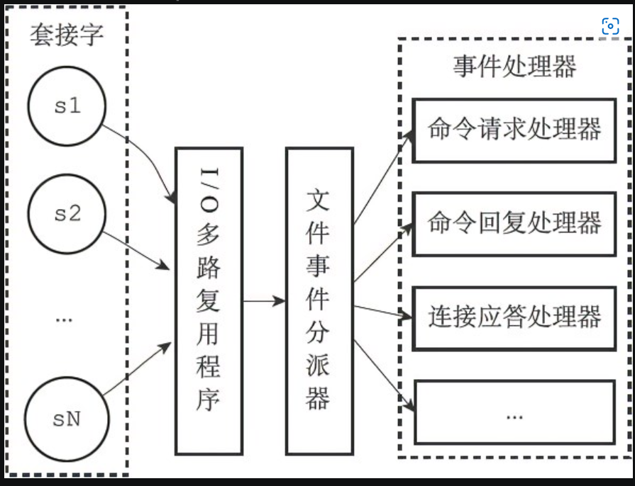

# 数据结构

## 简单动态字符串SDS

定义`len free buf三个字段`

- redis只会使用c作为字面量
- o(1)获取字符串长度
- 杜绝缓存区溢出
- 减少修改长度是需要的内存重分配次数
- 二进制安全
- 兼容c部分函数

## 链表

特性：双端、无环、带表头和表位指针、带链表长度计数器、多态（可保存各种不同类型的值）

## 字典

- 哈希表作为底层实现
- 根据键计算出索引值->放到指定的索引上
- 使用链地址法解决哈希冲突，新节点添加到表头位置
- rehash 扩容和缩容，每个字典带两个哈希表，一个平时使用，一个rehash使用，渐进式的rehash，不是一次性完成

## 跳跃表

- 有序集合的底层实现之一
- 由zskiplist和zskiplistNode两个结构组成，zskiplist保存跳跃表信息（头尾节点 长度），zskiplistNode保存跳跃表节点
- 跳跃表层高是1-32的随机数
- 多个节点可以有相同的分值，成员对象必须是唯一的
- 按照分值大小排序，分值相同按照成员对象的大小排序

## 整数集合

- 集合键的底层实现之一
- 整数集合底层为有序、无重复的数据
- 有需要时会根据先添加的元素类型，改变数据类型
- 升级操作为整数集合带来灵活性，尽可能的节约内存
- 只支持升级，不支持降级

## 压缩列表

- 为节约内存而开发的顺序性数据结构
- 压缩列表被用作列表键和哈希键的底层实现之一
- 包含多个节点，每个节点保存一个字节数组or整数值
- 连锁更新：保存前一个节点的长度，大于254使用5字节，小于使用1字节
- 添加新节点or删除节点，可能会引发连锁更新操作，但出现几率不高

# 对象

包括 字符串、列表、哈希、集合和有序集合

实现基于引用计数的内存回收机制

访问时间记录信息，计算空转时长

### 字符串对象

- int、raw、embstr
- embstr专门用于保存短字符串的一种编码方式，一次内存分配一块连续空间，包含redispbject和sdshdr两个结构
- 会进行编码转换，embstr编码实际上是只读的。
- 字符串对象是五种类型中唯一会被其他类型嵌套的对象

### 列表对象

- ziplist或linkedlist

### 哈希对象

- ziplist或hashtable

### 集合对象

- 整数集合or hashtable（字典的值为null）

### 有序集合对象

- ziplist（第一个保存成员，第二个保存分值） or skiplist
- skiplist编码使用zset结构，包括字典和跳跃表，实现不同的功能，提高效率，通过指针共享相同的成员和分值，不会浪费内存

### 类型检查和命令多态

- redisobject的type属性确定类型
- 基于命令的多态和基于编码的多态

### 内存回收

- 引用计数：创建对象、操作对象和释放对象

### 对象共享

- 指针指向现有值对象
- 引用计数+1
- 会共享0-9999的字符串对象

### 对象的空转时长

- 记录对象最后一次被命令访问的时间，用于计算空转时间

# 单机数据库

## 数据库

``` c
struct redisServer {
    redisDb *db;
    list *clients; // 保存所有客户端状态
}
struct redisDb{
    dict *dict; // 数据库键空间 是一个字典
    dict *expires; // 数据库过期字典 值为过期时间
}

redisClient 客户端状态结构
```

- 每个redisdb结构代表一个数据库，默认是0号数据库

- TTL计算并返回剩余生存时间 PTTL毫秒

### 过期删除策略

- 定时删除 对内存友好 cpu时间不友好

- 惰性删除 cpu友好，内存不友好
- 定期删除 折中 随机检查一部分键的过期时间，删除其中的过期键
- redis实际使用的是惰性删除和定期删除
- 数据库中包含过期键不会对生成新的RDB文件造成影响

### 重点

- Redis 服务器的所有数据库都保存在 redisserves.db数组中，而数据库的数量则由 redisserver.dbnum 属性保存。
- 客户端通过修改目标数据库指针，让它指向redisServer.db数组中的不同元素来切换不同的数据库。
- 数据库主要由 dict 和 expires 两个字典构成，其中dict 字典负责保在键值对，而expires 字典则负责保存键的过期时间。
- 因为数据库由字典构成，所以对数据库的操作都是建立在字典操作之上的。
- 数据库的键总是一个字符串对象，而值则可以是任意一种Redis 对象类型，包括字符串对象、哈希表对象、集合对象、列表对象和有序集合对象，分别对应字符串键、哈希表键、集合键、列表键和有序集合键。
- expires 字典的键指向数据库中的某个键，而值则记录了数据库键的过期时间，过期时间是一个以毫秒为单位的 UNIX 时间戳。
- Redis使用隋性删除和定期删除两种策略来删除过期的键：惰性删除策略只在碰到过期键时才进行删除操作，定期删除策略则每隔一段时间主动查找并删除过期键。
- 执行 SAVE 命令或者 BGSAVE 命令所产生的新RDB 文件不会包含已经过期的键。
- 执行 BGREWRITEAOF 命令所产生的重写 AOF 文件不会包含已经过期的键。
- 当一个过期键被删除之后，服务器会追加一条DEL命令到现有 AOF 文件的末尾显式地删除过期键。
- 当主服务器删除一个过期键之后，它会向所有从服务器发送一条DEL 命令，显式地删除过期键。
- 从服务器即使发现过期键也不会自作主张地删除它，而是等待主节点发来DEL命令，这种统一、中心化的过期键删除策略可以保证主从服务器数据的一致性。
- 当Redis 命令对数据库进行修改之后，服务器会根据配置向客户端发送数据库通知

## RDB 持久化

- RDB 文件用于保存和还原 Redis 服务器所有数据库中的所有键值对数据。

- SAVE 命令由服务器进程直接执行保存操作，所以该命令会阻塞服务器。
- BGSAVE 令由子进程执行保存操作，所以该命令不会阻塞服务器。
- 服务器状态中会保存所有用 save 选项设置的保存条件，当任意一个保存条件被满足时，服务器会自动执行 BGSAVE 命令。
- RDB 文件是一个经过压缩的二进制文件，由多个部分组成。
- 对于不同类型的键值对，RDB 文件会使用不同的方式来保存它们。
- 如果开启了AOF，会优先使用AOF文件来还原

## AOF持久化

### 笔记

- append only file
- 通过保存redis服务器所执行的写命令来记录数据库状态
- 追加append、写入、同步sync
- redis的服务器进行就是一个事件循环loop
- AOF重写是通过服务器读取当前的数据库状态来实现的
- AOF重新缓冲区，保证数据一致

### 重点

- AOP文件通过保存所有修改数据库的写命令请求來记录服务器的数据库状态。
- AOF文件中的所有命令都以Redis命令请求协议的格式保存。
- 命令请求会先保存到AOF缓沖区里面，之后再定期写入并同步到AOF文件
- appendfsync选项的不同值对AOF特久化功能的安全性以及 Redis服务器的性能有很大的影响。
- 服务器只要载入并重新执行保存在AOF文件中的命令，就可以还原数据库本来的状态
- AOF重写可以产生一个新的AOF文件，这个新的AOF文件和原有的AOF文件所保存的数据库状态一样，但体积更小
- AOF重写是一个有歧义的名字，该功能是通过读取数据库中的键值对来实现的，程序无须对现有AOF文件进行任何读、分析或者写操作。
- 在执行BGREWRITEAOF命令时，Redis服务器会维护一个AOF 重写缓冲区，该缓冲区会在子进程创建新AOF文件期间，记录服务器执行的所有写命令。当子进程完成创建新AOF文件的工作之后，服务器会将重写缓冲区中的所有内容追加到新AOF文件的末尾，使得新旧两个AOF文件所保存的数据库状态一致。最后，服务器用新的AOF文件替换旧的AOF文件，以此来完成AOF文件重写操作。

## 事件

### 笔记

- redis是一个事件驱动程序
- 文件事件 服务器对套接字操作的抽象
- 时间时间 对于一些给定时间点操作的抽象

### 文件事件处理器

- Redis基于Reactor模式开发了自己的网络事件处理器：这个处理器被称为文件事件处理器（file event handler）

- 文件事件处理器使用I/O多路复用（multiplexing）程序来同时监听多个套接字，并根据套接字目前执行的任务来为套接字关联不同的事件处理器。
- 当被监听的套接字准备好执行连接应答（accept）、读取（read）、写入（write）、关闭（close）等操作时，与操作相对应的文件事件就会产生，这时文件事件处理器就会调用套接字之前关联好的事件处理器来处理这些事件。
- 虽然文件事件处理器以单线程方式运行，但通过使用I/O多路复用程序来监听多个套接字，文件事件处理器既实现了高性能的网络通信模型，又可以很好地与Redis服务器中其他同样以单线程方式运行的模块进行对接，这保持了Redis内部单线程设计的简单性


### I/O多路复用

- 事件驱动 只有在调用select、poll、epoll时，才会产生阻塞，收发客户端消息不会阻塞 reactor模式
- 进程间切换很耗资源
- 阻塞io、非阻塞io、多路复用

### 时间事件

- Redis的时间事件分为以下两类
  - 定时事件：让一段程序在指定的时间之后执行一次。比如说，让程序X在当前时间的30毫秒之后执行一次。
  - 周期性事件：让一段程序每隔指定时间就执行一次。比如说，让程序Y每隔30毫秒就执行一次。

- 目前redis只使用周期性事件，没有使用定时事件
- 服务器将所有时间事件都放在一个无序链表中，每当时间事件执行器运行时，它就遍历整个链表，查找所有已到达的时间事件，并调用相应的事件处理器

### 事件调度与执行


- 对文件事件和时间事件的处理都是同步、有序、原子地执行的，服务器不会中途中断事件处理，也不会对事件进行抢占，因此，不管是文件事件的处理器，还是时间事件的处理器，它们都会尽可地减少程序的阻塞时间，并在有需要时主动让出执行权，从而降低造成事件饥饿的可能性。比如说，在命令回复处理器将一个命令回复写入到客户端套接字时，如果写入字节数超过了一个预设常量的话，命令回复处理器就会主动用break跳出写入循环，将余下的数据留到下次再写；另外，时间事件也会将非常耗时的持久化操作放到子线程或者子进程执行
  
### 重点

- Redis服务器是一个事件驱动程序，服务器处理的事件分为时间事件和文件事件两类。

- 文件事件处理器是基于Reactor模式实现的网络通信程序。
- 文件事件是对套接字操作的抽象：每次套接字变为可应答（acceptable）、可写（writable）或者可读（readable）时，相应的文件事件就会产生。
- 文件事件分为AE_READABLE事件（读事件）和AE_WRITABLE事件（写事件）两类。
- 时间事件分为定时事件和周期性事件：定时事件只在指定的时间到达一次，而周期性事件则每隔一段时间到达一次。
- 服务器在一般情况下只执行serverCron函数一个时间事件，并且这个事件是周期性事件。
- 文件事件和时间事件之间是合作关系，服务器会轮流处理这两种事件，并且处理事件的过程中也不会进行抢占。
- 时间事件的实际处理时间通常会比设定的到达时间晚一些。

## 客户端

- 服务器状态结构使用clients链表连接起多个客户端状态，新添加的客户端状态会被放到链表的末尾。
- 客户端状态的flags属性使用不同标志来表示客户端的角色，以及客户端当前所处的状态。
- 输入缓冲区记录了客户端发送的命令请求，这个缓冲区的大小不能超过1GB。
- 命令的参数和参数个数会被记录在客户端状态的argv和argc属性里面，而cmd属性则记录了客户端要执行命令的实现函数。
- 客户端有固定大小缓冲区和可变大小缓冲区两种缓冲区可用，其中固定大小缓冲区的最大大小为16KB，而可变大小缓冲区的最大大小不能超过服务器设置的硬性限制值
- 输出缓冲区限制值有两种，如果输出缓冲区的大小超过了服务器设置的硬性限制，那么客户端会被立即关闭；除此之外，如果客户端在一定时间内，一直超过服务器设置的软性限制，那么客户端也会被关闭。
- 当一个客户端通过网络连接连上服务器时，服务器会为这个客户端创建相应的客户端状态。网络连接关闭、发送了不合协议格式的命令请求、成为CLIENT KILL命令的目标、空转时间超时、输出缓冲区的大小超出限制，以上这些原因都会造成客户端被关闭。
- 处理Lua脚本的伪客户端在服务器初始化时创建，这个客户端会一直存在，直到服务器关闭。
- 载入AOF文件时使用的伪客户端在载入工作开始时动态创建，载入工作完毕之后关闭

## 服务器

### 执行过程

1. 客户端向服务器发送命令请求SET KEY VALUE.
2. 服务器接收并处理客户端发来的命令请求SET KEY VALUE，在数据库中进行设置操作，并产生命令回复OK。
3. 服务器将命令回复OK发送给客户端。
4. 客户端接收服务器返回的命令回复OK，并将这个回复打印给用户观看

### serverCron函数

- serverCron函数默认每隔100毫秒执行一次，它的工作主要包括更新服务器状态信息，处理服务器接收的SIGTERM信号，管理客户端资源和数据库状态，检查并执行持久化操作等等。

### 服务器初始化

- 服务器从启动到能够处理客户端的命令请求需要执行以下步骤：1）初始化服务器状态；2）载入服务器配置；3）初始化服务器数据结构；4）还原数据库状态；5）执行事件循环

## 复制

### 旧版

- 主服务器的bgsave命令执行完毕后，将生成的rdb文件发送给从服务器，从服务器接受，更新至主服务器执行bgsave时的状态

- 主服务器将缓冲区里面的写命令发送给从服务器
缺陷
- 断线后复制效率很低

### 新版

psync代替sync

- 具有完整重同步和部分重同步
- 复制偏移量
- 积压缓冲区 固定长度的队列
- 服务器id 用于对比是否为同一个主服务器

- 在复制操作刚开始的时候，从服务器会成为主服务器的客户端，并通过向主服务器发送命令请求来执行复制步骤，而在复制操作的后期，主从服务器会互相成为对方的客户端。
- 主服务器通过向从服务器传播命令来更新从服务器的状态，保持主从服务器一致，而从服务器则通过向主服务器发送命令来进行心跳检测，以及命令丢失检测。

## sentinel 哨兵模式

- Sentinel只是一个运行在特殊模式下的Redis服务器，它使用了和普通模式不同的命令表，所以Sentinel模式能够使用的命令和普通Redis服务器能够使用的命令不同。

- Sentinel会读入用户指定的配置文件，为每个要被监视的主服务器创建相应的实例结构，并创建连向主服务器的命令连接和订阅连接，其中命令连接用于向主服务器发送命令请求，而订阅连接则用于接收指定频道的消息。
- Sentinel通过向主服务器发送INFO命令来获得主服务器属下所有从服务器的地址信息，并为这些从服务器创建相应的实例结构，以及连向这些从服务器的命令连接和订阅连接。
- 在一般情况下，Sentinel以每十秒一次的频率向被监视的主服务器和从服务器发送INFO命令，当主服务器处于下线状态，或者Sentinel正在对主服务器进行故障转移操作时，Sentinel向从服务器发送INFO命令的频率会改为每秒一次。
- 对于监视同一个主服务器和从服务器的多个Sentinel来说，它们会以每两秒一次的频率，通过向被监视服务器的__sentinel__:hello频道发送消息来向其他Sentinel宣告自己的存在。
- 每个Sentinel也会从__sentinel__:hello频道中接收其他Sentinel发来的信息，并根据这些信息为其他Sentinel创建相应的实例结构，以及命令连接。
- Sentinel只会与主服务器和从服务器创建命令连接和订阅连接，Sentinel与Sentinel之间则只创建命令连接。
- Sentinel以每秒一次的频率向实例（包括主服务器、从服务器、其他Sentinel）发送PING命令，并根据实例对PING命令的回复来判断实例是否在线，当一个实例在指定的时长中连续向Sentinel发送无效回复时，Sentinel会将这个实例判断为主观下线。
- 当Sentinel将一个主服务器判断为主观下线时，它会向同样监视这个主服务器的其他Sentinel进行询问，看它们是否同意这个主服务器已经进入主观下线状态。
- 当Sentinel收集到足够多的主观下线投票之后，它会将主服务器判断为客观下线，并发起一次针对主服务器的故障转移操作。

## 集群

- 分片
- 节点通过握手来将其他节点添加到自己所处的集群当中。
- 集群中的16384个槽可以分别指派给集群中的各个节点，每个节点都会记录哪些槽指派给了自己，而哪些槽又被指派给了其他节点。
- 节点在接到一个命令请求时，会先检查这个命令请求要处理的键所在的槽是否由自己负责，如果不是的话，节点将向客户端返回一个MOVED错误，MOVED错误携带的信息可以指引客户端转向至正在负责相关槽的节点。
- 对Redis集群的重新分片工作是由redis-trib负责执行的，重新分片的关键是将属于某个槽的所有键值对从一个节点转移至另一个节点。
- 如果节点A正在迁移槽i至节点B，那么当节点A没能在自己的数据库中找到命令指定的数据库键时，节点A会向客户端返回一个ASK错误，指引客户端到节点B继续查找指定的数据库键。
- MOVED错误表示槽的负责权已经从一个节点转移到了另一个节点，而ASK错误只是两个节点在迁移槽的过程中使用的一种临时措施。
- 集群里的从节点用于复制主节点，并在主节点下线时，代替主节点继续处理命令请求。
- 集群中的节点通过发送和接收消息来进行通信，常见的消息包括MEET、PING、PONG、PUBLISH、FAIL五种。

# 笔记

- [x] map kv外层封装，hash是底层实现之一
- [x] 哈希 空间换时间
- [x] 哈希算法
- [x] 链式解决冲突
- [ ] 连续内存 缓存
- [ ] cpu缓存？
- [ ] 新的list编码类型 quicklist
- [ ] 线程和进程的区别
- [ ] io多路复用是啥
- [ ] 套接字是啥
- [ ] Reactor模式
